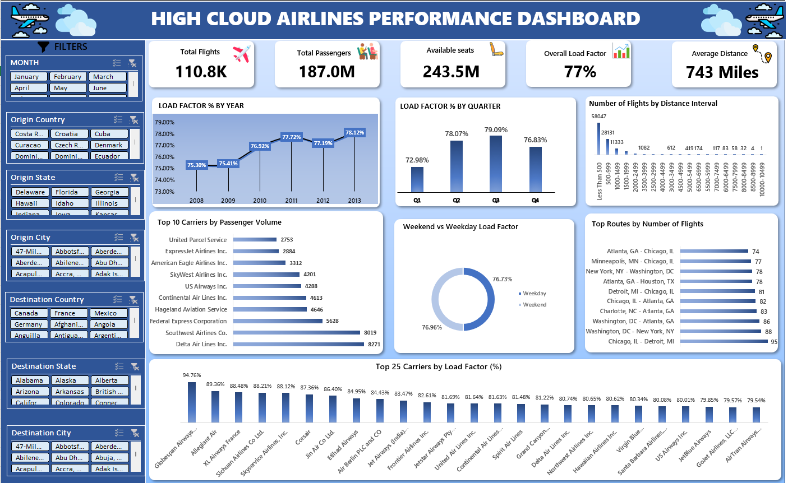

# ✈️ Airline Performance Dashboard

---

# 📌 Project Overview

This project is an interactive Airline Performance Dashboard developed in Microsoft Excel.

The dashboard transforms raw airline operational data into meaningful business insights using Pivot Tables, Pivot Charts, KPIs, Slicers, and Excel formulas.

It enables users to analyze airline performance across different years, quarters, carriers, routes, and distance intervals.

---

# 🎯 Business Objective

The objective of this project is to analyze airline performance and answer key business questions such as:

- What is the overall Load Factor?
- Which airlines have the highest Load Factor?
- Which routes have the most flights?
- How does Load Factor change over time?
- How are flights distributed across distance intervals?
- What is the Weekend vs Weekday Load Factor?

---

# 📊 Dashboard Preview

> 

---

# 📈 Key Performance Indicators (KPIs)

- ✈️ Total Flights
- 👥 Total Passengers
- 💺 Available Seats
- 📈 Overall Load Factor
- 🌍 Average Flight Distance

---

# 📊 Dashboard Features

- Load Factor % by Year
- Load Factor % by Quarter
- Number of Flights by Distance Interval
- Top 10 Carriers by Passenger Volume
- Weekend vs Weekday Load Factor
- Top Routes by Number of Flights
- Top 25 Carriers by Load Factor

---

# 🛠 Tools & Skills Used

- Microsoft Excel
- Pivot Tables
- Pivot Charts
- Slicers
- XLOOKUP
- IF Formula
- Data Cleaning
- KPI Design
- Dashboard Design
- Data Visualization

---

# 💡 Key Insights

- Overall Load Factor is approximately **77%**.
- Medium-distance flights contribute the highest number of flights.
- Passenger traffic varies across years and quarters.
- Some airlines consistently maintain higher load factors.
- Weekend and Weekday Load Factors are nearly identical.

---

# 📂 Files in this Repository

- 📊 airlines project.xlsx
- 🖼️ dashboard-preview.png
- 📄 README.md

---

# 👨‍💻 Author

**Shiva Mudhiraj**

Aspiring Data Analyst

GitHub: https://github.com/shiva2506

Email: shivasunny604@gmail.com
